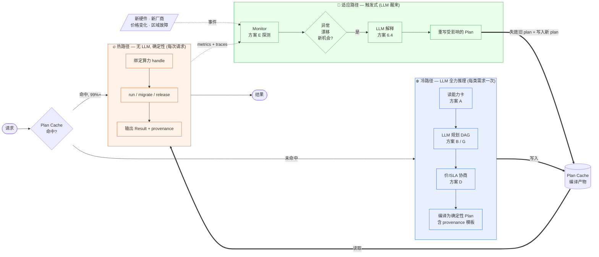

# 算力封装的巨大价值

> 把"算力"提升为与"程序"、"数据"并列的第三种被编码对象。
> 一旦算力可以被命名、描述、传递、替换、组合，整个软件世界的连接方式就会被重写一次——正如数据抽象在 1970 年代重写过一次。
>
> 全文一条贯穿主线：**LLM 是封装算力的"编译器与谈判者"，不是它的"执行者"。**

---

## 一、三次编码的历史类比

| 被编码的对象 | 编码形态 | 可被施加的操作 | 由此带来的新世界 |
|---|---|---|---|
| **算法** | 程序（可执行码、源码） | 调度、切换、迁移、编译、热更新、版本化 | 操作系统、多任务、跨平台 |
| **信息** | 数据（结构化/非结构化） | 查询、变换、复制、加密、流转 | 数据库、互联网、AI |
| **算力** | ？（尚未编码） | ？ | ？ |

历史规律是清晰的：**一个对象一旦被编码，就从"被使用的现场"变成"可被独立操作的对象"，新的产业和方法论随即出现。**

数据抽象（Liskov, 1977）的关键洞见——"对象的行为完全由一组操作刻画，使用者无需知道表示"——在算力上同样成立：**算力的行为也应由一组操作刻画，使用者无需知道它是 H100 还是 A100、是本地还是云端、是单机还是集群、甚至是 LLM 还是人类。**

> "**惯例无法替代强制约束。**" —— Liskov

今天我们调用算力的方式（写死 GPU 型号、写死区域、写死并发数、写死框架版本），正是 1970 年前数据访问的写法：依赖约定、依赖文档、依赖人记得。一旦泄漏，就要重写一切。**算力封装就是把这一层写死的"约定"变成机器强制的"接口"。**

---

## 二、算力封装的定义（沿用 CLU 的语法直觉）

借 Liskov 的话改写一行：

> **An abstraction of compute consists of a set of compute resources and a set of operations characterizing their behavior.**

伪代码草图：

```
gpu_pool = compute_cluster is allocate, run, snapshot, migrate, release
  rep = record [
    capability:   { flops: f16, mem: GB, interconnect, locality, jurisdiction },
    cost_model:   $/token | $/sec | $/job,
    sla:          { latency_p99, availability, carbon_g_per_token },
    state:        { busy, free, degraded }
  ]
  allocate = proc (demand: ComputeDemand) returns (handle) ...
  run      = proc (h: handle, prog: Program, data: Data) returns (Result) ...
  snapshot = proc (h: handle) returns (CheckpointRef) ...
  migrate  = proc (h: handle, target: PlacementHint) ...
  release  = proc (h: handle) ...
```

注意三件事：

1. **capability、cost、sla 都进了类型签名**，编译/调度期可校验，不再靠 README。
2. **`run` 接收程序与数据**——这正是"三元封装"的合流点：算力对象 × 程序对象 × 数据对象。
3. **使用方只见操作，不见 H100/A100/TPU/边缘 NPU**。换实现，不改调用方。

---

## 三、封装解锁的十种基础能力

每一条都对应一个目前用"人 + 文档 + 运维脚本"勉强支撑、且经常出错的环节。这十种能力是**封装本身**带来的，不依赖 LLM；后续 LLM 只是让它们变得便宜、可触达。

| 能力 | 一句话 | 类比 |
|---|---|---|
| **可调度** | 调度器跨集群、跨云、跨架构分配工作负载 | 程序被编码后 OS 才能切换进程 |
| **可迁移** | 工作负载从 8×H100 迁到 16×A100 再到量子求解器，调用方零改动 | 进程在物理机间热迁移 |
| **可组合** | 一条请求拆为子任务，每段绑到不同算力对象，运行时拼装 | UNIX pipe |
| **可替换** | 同一接口背后是 Haiku / Sonnet / Opus / 本地 7B 都行 | 接口与实现分离 |
| **可快照与回放** | 输入、模型版本、硬件指纹、随机种子、能耗都成为一等公民 | 数据库事务日志 |
| **可计费与可交易** | 卖方发布 capability+price+SLA，买方发布 demand+budget+deadline | 数据催生数据市场 |
| **可观测与可归因** | 每次 `run` 自带签名：硬件、能耗、碳、辖区 | git blame |
| **可降级与可弹性** | 同代码在手机/笔记本/千卡集群透明伸缩 | 响应式布局 |
| **可隔离与可形式约束** | 配额/安全域/驻留地/能耗上限进类型，入队期硬拒违规 | 类型系统 |
| **可被 Agent 引用** | Agent 可申请、释放、推理自身算力底座（详见 §6.6） | 反射 |

**这十种能力共同把算力从"配置事项"升级为"程序对象"**——这是从机制层面就成立的价值，不需要 LLM 也成立；LLM 只是让代价骤降。

---

## 四、四个让价值具体化的场景

### 场景 A · 一行代码穿越异构算力
今天：
```python
# 写死了 vendor、region、model
client = anthropic.Anthropic(); client.messages.create(model="claude-opus-4-7", ...)
```
封装后：
```python
result = compute.run(
    demand = Demand(task="long-doc summarize", quality≥0.9, latency<3s, budget<$0.05),
    program = summarize_v2,
    data = doc,
)
# 调度器在 Opus / Sonnet / 自托管 70B / 边缘 7B 之间挑选并组合
```
**模型/硬件演进的红利自动落到所有应用上，不需重写。**

### 场景 B · 灾备从"运维剧本"变成"类型推导"
区域故障时，今天靠 SRE 翻 Runbook、改 DNS、迁数据。
封装后，故障区域的算力对象批量 invalid，调度器**对所有 outstanding handle 自动求解等价替代**——因为 capability 是机器可读的。MTTR 从小时降到秒。

### 场景 C · 训练-推理-边缘的同一份代码
一个语音助手在云上训练个性化层、在用户手机本地推理，**两端是同一段程序、同一种算力调用**，差异完全被算力对象的 capability 字段吸收。今天这要三个团队、三套代码、三套 CI。

### 场景 D · 算力溯源驱动的合规与碳核算
欧盟某监管要求："这条 AI 输出是在哪国、用了多少能、训练数据是否合规？"
今天答不出。封装后这是 `result.provenance` 一个字段。**合规从成本中心变成自动属性。**

---

## 五、为什么是现在：大模型让封装从"不可行"变成"可行"

第三、四节描述的是**封装本身**的价值。这一节回答：为什么过去几十年没人把算力封起来？

历史上每次编码的成本都很高：
- 程序的编码经历了汇编→高级语言→编译器/运行时几十年；
- 数据的编码经历了文件格式→关系模型→Schema 演化几十年。

**算力的编码本来更难**——硬件型号、驱动版本、网络拓扑、内存层级、框架兼容性，描述空间巨大且永远在变。任何一个想统一这层的标准（CORBA、OCI、ONNX、OpenTelemetry）都缓慢且不完整，因为：
- 标准委员会的速度永远赶不上硬件迭代；
- 异构厂商不愿共享真实属性；
- 长尾算力（特种求解器、嵌入式、科学仪器、人类专家池）根本不会被纳入。

LLM 改变了这一处死结，关键在**三层**：

1. **描述层即权重**——LLM 已读过 NVIDIA 白皮书、AWS 实例规格、Triton 文档、PyTorch 内核源码；算力世界的本体论已被压缩进模型。**新硬件加入生态今天只需写一篇 README，不必等任何标准。**
2. **自然语言成为可执行的描述语言**——"找一个能跑 70B FP16、p99<2s、欧盟境内、$<0.001/token 的算力"可被 LLM 解析、规划、撮合。
3. **Schema 漂移的成本骤降**——硬件升级或新厂商出现，只要有自然语言描述，LLM 就能纳入抽象。

> **在前 LLM 时代，算力封装的描述层会被无穷的异构性压垮；在 LLM 时代，描述层就是模型的常识。**

这是一个一次性的窗口红利：**它解释的不是"为什么封装有价值"，而是"为什么这件事直到现在才可做"。**

---

## 六、大模型解锁的"新质能力"

第五节说的是"现在做这件事比以前便宜"。这一节是更强的论断：**大模型让算力封装拥有了在前 LLM 时代根本不存在的能力**。它们不是量变，而是质变——前提是把 LLM 用对地方（见第八节的分层原则）。

### 6.1 适配器即时合成（JIT Adapter Synthesis）
传统集成：每接入一个新算力源，要写胶水代码（auth、序列化、错误码翻译、超时处理）。
封装层 + LLM：
```
请求来了 → 没匹配到现成 adapter → LLM 读取目标资源的 OpenAPI/SDK 文档 →
现场合成一段适配代码 → 跑过验证用例 → 缓存为编译产物
```
**接入工程从"周"压到"分钟"**，新硬件出现的速度不再受人类工程师带宽限制。

### 6.2 能力可被"探测"而非仅被"声明"
厂商声明的 capability 卡可能撒谎、过时、粒度太粗。LLM 可编排**探测任务**（已知答案的 benchmark prompt、微基准 kernel、混沌注入），读响应、推断真实能力、写回 capability 向量。**算力的真实属性从此是可观测后验，而非市场宣传。**

### 6.3 算力对象"会自己说话"
每个封装好的算力对象可以挂一个 LLM 化的 spokesperson：
> "我现在 GPU 利用率 78%，剩余预算 $34，最近 1 小时长上下文请求的 p99 是 2.3s，建议你下一批任务用 batch=4。"

调用方不再需要解析十种 metrics 端点，**直接对话资源**。监控、调试、容量规划全部统一到对话界面。

### 6.4 失败可被语义化解释
传统：栈追踪 + Prometheus 时序，靠 SRE 推理。
封装 + LLM：
```
exception → LLM 读 trace + 上下文 + 资源状态 →
"OOM 因为 KV cache 没分页，建议 migrate 到 80GB 卡或开启 PagedAttention"
→ 直接生成 migrate(handle, target) 调用
```
**故障从"事件"升级为"带建议的事件"**，自治系统的关键缺口被补上。

### 6.5 算力 ↔ 算力之间可以协商
两个 Agent 化的算力对象用自然语言谈判：
> 消费方："我要在 5s 内处理 100K token，预算 $0.10。"
> 供给方："5s 做不到，给我 7s 我能压到 $0.06；或者降到 8K 上下文我能 5s 完成。"

这是**真正的算力市场**——不是固定 SKU 的目录采购，而是连续谈判空间。前 LLM 时代你必须把谈判结果固化成定价表，今天可以让谈判本身在线发生。

### 6.6 长尾算力的接入成本趋零
世界上有数百万种小众算力：实验室的特种求解器、科学仪器、嵌入式 NPU、甚至有 API 的人类专家池。它们各有怪癖，没人会为它们写官方 SDK。LLM 把它们都纳入同一抽象——**封装的边界从"主流硬件"扩展到"凡是能被自然语言描述的执行能力"**。这一步把"算力"的定义本身扩大了。

### 6.7 递归——LLM 既是封装的工具，也是被封装的对象
LLM 用来封装算力，而 LLM 本身就是算力对象。一个 Agent 可以：
- 用 LLM_A 决定该调用 LLM_B 还是 GPU 集群；
- 在调用 LLM_B 时为 LLM_B 注入"它有哪些下层算力可用"；
- 形成**算力对象自顶向下的反思链**。

这是程序与数据的世界从未具备的能力——程序不会观察自己的 OS，数据不会读取自己的存储引擎。**算力对象 + LLM 是第一种能反思自身底座的抽象**，是"自演进系统"的形式底座。

---

## 七、操作算力封装的八个思想方案

下面八个方案是相对独立、可叠加的设计原语。它们回答同一个问题——**"封装之后，谁来按按钮？"**——并给出从 6.1–6.7 的能力到工程系统的桥梁。

每个方案的格式统一为：**机制 / 让什么变易 / 主要风险 / 对应到第六节的哪条能力**。

### 方案 A · 能力卡 + 语义匹配器
**机制**：每个算力对象发布一份 markdown 能力卡（能做什么、价格、延迟、典型样例、失败模式）；需求方写自然语言需求；轻量 LLM 匹配器对卡片做语义检索 + 排序。
- 易：接入新算力 = 写一份卡片，无需对接 SDK
- 险：卡片可能失真 → 由方案 E 校准
- 对应能力：6.6（长尾接入）

### 方案 B · 需求即 Prompt（Demand-as-Prompt）
**机制**：调用方不写代码，写**意图**；规划 LLM 把意图分解为 DAG，每个节点经方案 A 路由到具体算力对象。
- 易：业务代码消失，剩下"我要什么"
- 险：不确定性 → 用约束 prompt + plan 缓存 + dry-run 兜底
- 对应能力：6.4（语义化失败 + 自动修补）

### 方案 C · 双向翻译层
**机制**：调用方说 Caller-API，资源说 Resource-API，中间放 LLM 翻译层做双向转换。
```
Caller ──"我要 X"──▶ [LLM Translate] ──▶ Resource API
Caller ◀── 标准化结果 ◀── [LLM Translate] ◀── Resource Response
```
- 易：胶水代码（Terraform、SDK、protobuf shim）整体消失
- 险：翻译失真 → 用形式契约 + 回归抽样测试
- 对应能力：6.1（JIT 适配器）

### 方案 D · 算力 Agent 市场
**机制**：每个资源前置一个 Agent；消费 Agent 自由询价、协商、签约（用签名 prompt / JWT 作为可执行合同）；注册表只做发现，协议本体是对话。
- 易：动态定价、长尾供给、跨厂商竞标自然发生
- 险：信任与仲裁 → 凭据链 + 链下/链上仲裁
- 对应能力：6.5（在线协商）

### 方案 E · 实时探测 + 持续校准
**机制**：不轻信声明；系统按需向资源发送小型探测任务（已知答案的 benchmark、微基准），LLM 解读响应、更新真实 capability。声明是先验，实测是后验。
- 易：性能宣传 → 客观可验
- 险：探测成本 → 自适应频率 + 共享探测池
- 对应能力：6.2（能力可探测）

### 方案 F · 静态类型 + LLM 精化（Hybrid Typing）
**机制**：
- **静态层**：可枚举属性（FP16/BF16、内存量、区域、价格区间），编译期硬过滤，亚毫秒
- **语义层**：开放属性（"擅长数学"、"长上下文稳定"、"中文友好"），LLM 软排序
- 先静态硬过滤把候选缩到 O(10)，再 LLM 排序
- 易：兼顾速度与表达力
- 险：两层接口需清晰，避免漏网
- 对应能力：跨多条；是把第八节"AI 不上热路径"原则落到匹配器内部

### 方案 G · LLM 即顶层规划器（顶配版冷路径）
**机制**：把"决定怎么做"这件事完全交给一个高能力 LLM——它持有所有算力对象引用、读所有能力卡、规划 DAG、生成合同，但**产物是一份编译后的 plan，不是热路径调用**。
- 易：所有抽象边界在线维持，无需事先定义
- 险：慢、贵、难审计 → 仅作为冷路径大脑，**绝不放执行链**
- 对应能力：6.3、6.4、6.7 的总控
- ⚠ 注意：这**不是"LLM 即操作系统内核"**——内核要确定、要可审计；LLM 是它上面的规划者。

### 方案 H · 三时序架构：冷 / 热 / 适应（核心架构原则）
**这是把方案 A–G 工程化的总框架。**

| 时序 | 动作 | 谁在做 | 频率 |
|---|---|---|---|
| **冷路径** | 接入、规划、首次匹配、合同生成 | LLM 全力推理 | 每种新需求一次 |
| **热路径** | 实际执行、相同请求复用 | 编译后的 plan，无 LLM | 每次请求 |
| **适应路径** | 异常、漂移、新硬件出现 | LLM 醒来重写 plan | 触发式 |

> **LLM 是新一代的"编译器"**——重推理在编译期一次性完成，运行期跑确定性产物，遇到失效再回到编译期。
> 这一原则把方案 A–G 的效率与可信度变成可工程化的，也是第八节分层判断的基础。

#### 架构图



**读图三件事**：
1. **Plan Cache 是中心**——冷路径写它，热路径读它，适应路径改它；三条路径全部经 Cache 解耦。
2. **LLM 只出现在冷路径与适应路径，从不出现在热路径**——这是延迟、成本、可审计性的来源。
3. **新硬件/新价格/区域故障是"事件"而不是"工单"**——它们直接进 Monitor，由 LLM 解释并重写 Plan，不经过人。

#### 钩子：一眼看见"封装"的形状

来一个**今天没有产品真正做对、但人人想要**的 to C 例子——
**"周末两天上海，AI 替我玩好"**。

不是丢给你一份死攻略，而是：

**用户的 intent**：`两天上海，2000元/人，city walk + 小馆子，不要网红，怕排队`

**冷路径（一次思考，~10s）**：LLM 调度所有候选算力——
地图 API、点评/小红书评分、天气、实时人流、闭店通报、自家编排 LLM——
推理出 Plan：`偏好理解 → 多源候选召回 → 时空编排 → 两天行程 + 备用分支`，
写入 Cache。

**热路径（之后每次打开 App，零 LLM 决策）**：
看下一站、导航、附近推荐，全是编译好的轻量调用。

**适应路径——这才是杀手锏（事件驱动，用户体感最强）**：
- 出门第一天突降暴雨 → 室外 walk 段自动重写为室内备选
- 目标餐厅周一闭店 → 同片区评分相近的另一家替补
- 地铁 4 号线临时检修 → 改走公交
- 你临时说"加个咖啡馆" → 局部 Plan 重写，全局不动
- **新一代"实时人流预测"模型上线 → 下次打开 App，
  等位预估精度跳升 30%，App 没发版**

用户只说"玩好"；"今天具体走哪、吃哪、暴雨怎么办、新模型来了怎么用"
全部外置到一个**永远在自适应的 Plan**。
今天的攻略 App、ChatGPT 旅游问答、小红书攻略缺的就是后两条路径——
这也是为什么没人觉得"AI 真的替我玩了一趟"。

—— 冷路径思考、热路径执行、适应路径维持新鲜。

旅行例子的工程复杂度大头在**外部数据源接入**（地图/天气/人流/闭店都要持续抓取）。换一个**纯算力、纯文字、单次成本低到可忽略**的 to C 钩子，体现封装价值的另一个面相。

#### 钩子（纯文字版）：AI 替我把书"嚼碎并永久记得"

**"上传一本书 / 一篇长论文 / 一份报告，AI 按我的阅读节奏嚼碎、做闪卡，并永久记得，未来随时可问"**——输入只是用户上传的 PDF/EPUB，没有任何爬虫；输出全是文字，单次推理成本极低。

**用户的 intent**：`digest(book.pdf, 进度=第3章, 风格=费曼讲解, 输出=章节摘要+闪卡+延伸问题, 后续可问答)`

**冷路径（每本书一次）**：LLM 编排 Plan =
`parse → chunk → embed → 章节摘要 → 闪卡生成 → 延伸问题 → 写入永久记忆`，
按"风格 + tier"选模型组合（端侧小模型嚼粗、云端大模型嚼细），
写入 Cache，键 = `(book hash, 风格, tier)`。

**热路径（之后每次打开 / 问问题，零 LLM 决策）**：
显示当前章节嚼好的内容；问问题走永久记忆 RAG。

**适应路径（这里的杀手锏：模型升级回溯历史）**：
- 新一代 embedding 模型上线 → 后台异步把**所有过往书**重新 index →
  下次打开三年前读的书，**突然浮现出和你昨天读的新书之间的关联**
- 新 LLM 上线 → 闪卡和摘要质量自动跳升，老书也受益
- 你说"换苏格拉底式风格" → 新 Plan，老书按新风格重嚼一遍

**两个钩子的分工**：

|  | 旅行 AI | 读书 AI |
|---|---|---|
| 输入来源 | 用户偏好 + **外部世界状态** | 用户上传文本，**纯本地** |
| 单次算力成本 | 中（多源 + LLM 编排） | **极低**（小推理） |
| 适应路径主要事件 | 天气 / 人流 / 闭店 | **模型升级 + 历史回溯重刷** |
| 体现的封装价值 | 应对外部世界变化 | **长期个人知识资产 + 模型红利** |

—— 两个例子合起来覆盖了 to C 封装的两种典型场景。
下面的 SaaS 案例把同一套机制放到 B2B 算力调度里完整展开。

#### 案例：一个长文档摘要 SaaS

**场景**：一家公司提供"上传文档→获得摘要"。文档 10K–1M token，用户跨自由层/付费层/企业层，分布在多个司法辖区。

**没有三时序架构（今天的常态）**：
- 自由层硬编码 `model="haiku"`，付费层 `model="sonnet"`，企业层 `model="opus"`；
- Anthropic 发布 Sonnet 4.7（便宜 40%）→ 工程团队 2 周 A/B 测试与切换；
- us-east-1 故障 → SRE 手工切流，部分用户报错若干小时；
- 新厂商 FastInfer 报价更低 → 接入成本太高，永远不会被评估；
- 欧盟客户问"这条摘要在哪生成、多少碳"→ 业务侧手工拼数据，常常出错。

**有三时序架构后**：

**冷路径（每类需求一次，约 5 秒、$0.02）**
新企业用户首次签约："摘要 200K-token 法律合同，质量 ≥ 0.92，延迟 < 10s，预算 < $0.20，欧盟境内。"
- 读欧盟内所有候选算力的能力卡：Opus-EU、Sonnet-EU、自托管 Llama-70B-EU、FastInfer-EU
- LLM Planner 推理出最优 DAG：`chunk(40K) → Sonnet.summarize × 5 并行 → Opus.synthesize`，预估 $0.14 / 7s / 0.94 质量
- 协商生成合同（含 SLA、退款条款、provenance 字段定义）
- 编译为 Plan，写入 Cache，键 = `(200K, EU, legal, quality≥0.92)`

**热路径（之后每次请求）**
用户上传文档 → Cache 命中 → 直接执行编译好的 DAG → 返回结果 + provenance（"由 Sonnet-EU @ frankfurt-1 + Opus-EU @ paris-2 生成，能耗 18 J，0.011 g CO₂"）。**全程零 LLM 推理**，p99 = 7s 一如规划，每天跑数百万次。

**适应路径（事件驱动，对调用方完全不可见）**

| Day | 事件 | 适应路径动作 | 业务影响 |
|---|---|---|---|
| 30 | Sonnet 4.7 发布，价降 40% | Monitor 看到能力卡更新；LLM 重新评估；旧 Plan 失效；新 Plan 写入 | 下一次请求成本自动降 40%，**零代码改动** |
| 45 | FastInfer-EU p99 漂移到 18s | Monitor 探测发现；LLM 诊断"vendor-X EU 退化，回退到自托管 Llama-EU"；Plan 重写 | 几分钟内自动切流，**SRE 没被叫醒** |
| 60 | 新厂商 FastInfer 上线 | Capability 卡入库 → 探测任务（方案 E）跑已知答案 → 合格 → 部分 Plan 改用 FastInfer | 成本再降 15%，**接入工作量约等于零** |
| 75 | 客户问"上月所有摘要的总碳排" | `SELECT SUM(provenance.carbon_g) FROM results WHERE month=...` | **是一条 SQL，不是一个项目** |

**好处量化**

| 指标 | 传统 | 三时序架构 |
|---|---|---|
| 接入新模型 / 新厂商 | 2 周工程 | 0（capability 卡 + 探测自动完成） |
| 每请求 LLM 决策开销 | N/A 或 $0.001+ | $0（命中 Plan Cache） |
| 区域故障 MTTR | 小时级（SRE 介入） | 分钟级（适应路径自动） |
| 模型降价红利落地 | 季度 | 触发式秒到分钟 |
| 合规/碳数据 | 事后人工拼 | 接口默认输出 |
| 业务代码绑定 | vendor + model + region | 仅绑定**意图** |

**关键洞察**：业务代码只描述"我要什么"（demand），所有"怎么做"（plan）都被外置到 Cache，而 Cache 由 LLM 在冷/适应路径维持新鲜。**应用层的复杂度不再随算力世界的复杂度而增长。** 这正是把"封装"做对了的形态。

---

## 八、AI 应介入哪一层？——分层原则

直觉常错的是"既然 LLM 这么强，就处处用它"。这会带来不可承受的延迟、成本、不可审计性。判断如下：**AI 在描述与规划层强介入，在执行层退出。**

| 层 | AI 介入强度 | 理由 | 在第七节的位置 |
|---|---|---|---|
| 描述（capability/cost/sla 获取与维护） | **强** | 长尾异构性人类标准化做不完 | 方案 A、E |
| 发现与匹配（demand ↔ resource） | **强，但缓存** | 一次推理 → 多次复用 plan | 方案 A、F |
| 翻译（API 适配、schema 转换） | **强，但形式校验** | 翻译产物受契约约束 | 方案 C |
| 协商（价格、SLA、降级策略） | **中** | 自然语言天然适合谈判 | 方案 D |
| 监控与异常解释 | **中** | 把日志变成可执行建议 | 6.3、6.4 |
| **实际执行** | **退出** | 走确定性编译产物，可审计、可重放 | 方案 H 热路径 |
| 学习与策略演进 | **强（离线）** | 历史调用 → 更好默认 plan | 方案 H 适应路径 |

**总原则一句话**：
> **合同必须是确定的，发现合同的过程可以由模型完成。**

这正是软件工程几十年积累的智慧（编译/运行分离、声明/实现分离、策略/机制分离）在 AI 时代的对齐——不是抛弃旧原则，而是把 LLM 安插在过去人类啃不动的那一格里。

---

## 九、平台抽象清单：要支撑这套封装，平台需要提供什么

第七节给出三时序的形态，第八节给出 AI 在哪一层介入。落到工程上，需要一个**基础平台**。诚实地分层（避免把"常需要"和"必不可少"混在一起）：

```
┌─ 核心 6 件（架构定义级，缺一就不是三时序）
├─ 跨切关注点 3 件（任何严肃部署都要做）
└─ 场景条件性（按业务形态选配）
```

### 9.0a 核心 6 件——架构定义级，缺一不可

| # | 抽象 | 三时序中的角色 | 没它会怎样 |
|---|---|---|---|
| 1 | **能力卡注册 + 自动探测** | 描述层 | LLM Planner 没有世界观，无从规划 |
| 2 | **Intent SDK + 类型化多维约束** | 需求层 | Cache 没有 key，Plan 没有目标 |
| 3 | **Plan 编译器（冷路径）** | 冷路径引擎 | intent → plan 这步根本不发生 |
| 4 | **Plan Cache** | 解耦器（架构中心） | 冷热路径塌成一条，封装失效 |
| 5 | **确定性 DAG 运行时（热路径）** | 热路径引擎 | 热路径要么走回 LLM、要么不可审计 |
| 6 | **事件总线 + 适应路径调度器** | 适应路径引擎 | 三时序退化成两时序 |

各项展开：

**1. 能力卡注册 + 自动探测**——每个算力（地图/天气 API、云端/端侧 LLM、OCR、TTS……）都有机器可读的能力卡：I/O schema、成本、p99、覆盖区域、隐私等级、新鲜度。平台持续探测保持新鲜（方案 E）。to C 场景额外要支持**端侧能力卡**（不同机型 profile）。

**2. Intent SDK + 类型化多维约束**——业务用 5 行 DSL 声明 intent，约束跨成本/延迟/质量/隐私/地域/用户等级。Intent 是 first-class：可版本化、可继承、可组合，是 Plan Cache 的 key 来源。

**3. Plan 编译器**——LLM Planner 读能力卡 + intent → 输出**类型化 DAG**（必须支持分支、条件、备用节点——"暴雨走室内"是 Plan 内分支，不是临时叫醒 LLM）→ 编译成确定性 artifact，同时产出 SLA 合同与 provenance 模板。

**4. Plan Cache**——内容寻址（key = intent + 约束 + 上下文维度），多租户 Plan 共存，版本/TTL/原子切换。

**5. 确定性 DAG 运行时**——只执行编译好的 Plan，零 LLM。内建超时/回退/分支求值，自动写 provenance。**端云协同的执行调度也在这一层**。

**6. 事件总线 + 适应调度器**——一等公民的事件源：能力卡变更、价格变动、区域健康、**外部世界事件**（天气/人流/交通）、**用户显式插话**。Monitor 判定要不要重写 Plan，要的话醒 LLM，原子切换不打断进行中的请求。

### 9.0b 跨切关注点 3 件——任何严肃部署都要做

不属于"架构定义"，但只要上线就绕不开：

**7. Provenance / 审计日志**——每次执行写可查日志（用了哪些算子、各阶段耗时与成本、引用了哪些数据源、随机种子）。审计、debug、回放、合规、解释账单都靠它。

**8. 配额 / 计量账本**——任何多租户/多用户/分层定价系统都要：实时计量、配额扣减、超限熔断、按租户聚合账单。也是"免费走 Plan-A、付费走 Plan-B"的依据。

**9. 隐私边界 / 数据分级**——只要算力跨端云、跨厂商、跨地域，就必须在调度层标注数据敏感度与允许的流转路径。塞在运行时里悄悄做迟早出事——监管和用户信任都不答应。

### 9.0c 场景条件性——按业务形态选配

不是缺了就不能用，而是**特定形态的应用才需要**：

- **会话状态层** → to C 有状态场景（旅行助手、互动陪伴、嚼书）。to B 批处理几乎不要。
- **文档算子库 + 模板 + 文档 IR + 风格指纹 + fan-out 调度** → 文档类应用（详见 9.2）
- **多模态数据平面**（视频/音频流式 I/O、对象存储集成、CDN 边缘缓存）→ 媒体类应用
- **Agent 编排 + 工具调用沙箱** → agent 类应用
- **外部事件源插件市场** → 强外部依赖场景（旅行、信息流过滤）

---

**MVP 三件套（如果只能先做三件）**：
- **能力卡注册中心**——没它整个体系无源
- **Plan Cache + 编译器**——把"规划"与"执行"在**时间维度**上彻底分开（封装的本质）
- **事件总线 + 适应路径**——让 intent 稳定的同时，plan 永远新鲜

**这套平台的形状**：
> 它对开发者是一个"声明 intent 的 SDK + 一个永远在自适应的 Plan Cache"；
> 对算力供给方是一个"发布能力卡 + 接入事件源的市场"；
> 中间由 LLM 在冷/适应路径维持两侧的对齐。

---

### 9.1 Plan IR 与代码生成：为什么不能直接编译成 Python

直觉上，Plan 编译器最朴素的实现是"LLM 直接生成一段 Python"。Python 适合做 codegen 的**目标**，但**不能作为 Plan 的规范形式**。该有的两层结构：

```
Plan IR (typed DAG, declarative)         ← 规范形式，适应路径在这一层推理
       │
       ├─ codegen → Python      （服务端默认，调既有库最爽）
       ├─ codegen → TypeScript  （Web / RN 端）
       ├─ codegen → Swift / Kotlin  （iOS / Android 端侧节点）
       └─ codegen → WASM        （跨端、沙箱执行）
```

**为什么必须先有 IR、不能只有 Python**：

1. **适应路径要 diff/重写 Plan**——两段 Python 之间做语义 diff 很难且不可靠；两个 IR DAG 之间 diff 是结构化操作，LLM 也好读好改。
2. **端侧根本没有 Python 运行时**——iOS/Android 跑不了，浏览器更跑不了。规范形式不能绑死在某个语言运行时上。
3. **静态分析 / 成本估算 / SLA 校验**——结构化 IR 可以静态推出"这条 DAG 最多花 \$0.x、p99 ≤ y ms、不会泄露 PII 出端"；任意 Python 代码做不到（图灵完备直接放弃静态分析）。
4. **沙箱与资源界限**——审计任意 Python 难、限制资源也难；IR 是有限算子集合，沙箱天然成立。
5. **Plan Cache 的 key 设计**——结构化 IR 容易做内容寻址；Python 字符串容易因为格式微差导致 key 漂移。

**Python codegen 在这套结构里的真正价值**：

- 服务端**默认目标**——调 numpy/httpx/各家 SDK 最丝滑
- **可读性极强**——开发者打开生成的 .py 就能看懂 Plan 在做什么，对审计、debug、信任建立非常重要
- 走 **AOT 编译**——生成后做 mypy/pyright 类型检查，跑过才入 Plan Cache
- **Provenance 注入**——codegen 阶段自动在每个调用前后插桩，业务代码无感

**类比**：

| 这一层 | 类比 |
|---|---|
| Plan IR | LLVM IR / SQL 查询计划树 / React VDOM |
| Codegen 出 Python | LLVM IR → x86 汇编 / 计划树 → C 代码 / VDOM → DOM |

LLVM 不会让你只有 x86 而没有 IR；同理这里不能只有 Python 而没有 IR。

**一句话**：
> **Plan IR 是规范形式，Python 是 codegen 的一个（很重要的）目标，不是唯一目标。**

---

### 9.2 文档类应用：在核心 6 + 跨切 3 之上的特化抽象

文档类是 to C 封装的高频场景——嚼书、生成教案/日报、写邮件/简历/PPT、批量出长文。共同特征：长文本输入 + 结构化输出 + 模板驱动 + 多格式产物 + 图片嵌入 + 批量 fan-out + 长期个人语料沉淀。对应在核心 6 件 + 跨切 3 件之上叠加 6 件特化抽象。

**A. 文档算子库（Document Operators）**

`parse / chunk / outline / draft / revise / format / merge / cite / diff`——每个算子有稳定的 I/O 契约，LLM Planner 才能像搭积木一样编排。文档类 Plan 的 90% 就是这些算子的组合。

**B. 模板作为一等公民**

模板不是字符串拼接，而是**结构化骨架 + 类型化 slot + 填充约束**：

```
教案模板 = {
  课程目标: text<200字>,
  教学步骤: list<step{时长, 教师动作, 学生动作}>,
  习题:     list<problem{难度, 知识点, 答案}> minLen=5,
  评估:     rubric{维度, 等级},
  约束:     sum(教学步骤.时长) == 45min
}
```

约束可机器校验，生成失败 → 自动重试或局部重生成，**不污染整篇**。

**C. 结构化文档 IR + 多格式 codegen**

跟 Plan IR 同思路。规范形式是**文档树**（章节/段落/表/图/引用/脚注），然后 codegen 到 Markdown / docx (python-docx) / pdf (Typst/LaTeX) / pptx / EPUB / 飞书云文档 / Notion blocks。

- **不要让 LLM 直接产 docx 字节流**——不可校验、不可 diff、绑死格式、无法局部修改
- **让 LLM 产文档 IR，由确定性 codegen 出最终文件**——产物可静态检查、可版本化、可一键换格式

**D. 风格指纹（Style Fingerprint）+ 个人语料基底**

平台维护每个用户的：写作样本、术语偏好、点 👍 / 👎 的历史、过往嚼过的书与写过的稿。生成 Plan 自动注入这些上下文，输出经过**风格检查器**——不符则局部重写。这是"AI 写出来的还像我自己"的工程基础，也复用了"嚼书"钩子里的永久记忆设施。

**E. 批量 fan-out 调度 + 进度账本**

"按这个模板给 30 个学生各生成一份个性化教案"——平台提供：

- **并发调度**：按 Plan Cache 命中分批，命中的极快、不命中的限速跑
- **部分失败自动重试 + 局部重生成**，不退回整批
- **实时进度 + 实时成本预估 + 可中断**
- **人机协作模式**：先生成 3 份预览给我审 → 通过后批量跑剩下 27 份

**F. 图算子 + 嵌入管理**

图也是一类算子，统一进能力卡：Mermaid（确定性流程图）、matplotlib（数据图）、DALL·E / SDXL（写实图）、Excalidraw（手绘风）、各类业务图表 SDK。文档 IR 里图是 first-class 节点，嵌入时记录 provenance（生成模型、prompt、随机种子、版权许可），可重放、可换风格、可批量替换。

---

**落到"教案/日报"场景的具体形状**：

**用户的 intent**（教案）：
```
generate(模板=数学教案v3,
         数据=本周教学进度 + 学生掌握情况,
         数量=30份（每生一份）,
         风格=同我上学期教案一致,
         图=每份至少1张知识点关系图,
         输出=docx + 在线预览,
         <每份 $0.05)
```

**冷路径**：编译出 Plan =
`数据预处理 → 学生分组 → 模板槽位规划 → 草稿 LLM × 30 并行 → 图表生成 → 风格检查 → 文档树合并 → docx codegen`，写入 Cache。

**热路径**：每周点一次"生成本周教案"→ Cache 命中 → 30 份并发跑出来 + 进度条 + 成本累计 + docx 下载链接。

**适应路径**：
- 新一代图表模型更贴你画风 → 下次教案的图自动更好
- 你把上周教案手改了几处 → 风格指纹自动更新 → 下周生成往这个方向偏
- 模板升级到 v4 → 旧 Plan 自动失效，下次重编译
- python-docx 升级 / 换成 Typst 后端 → codegen 层切换，业务无感

---

**总结**：
> 文档类应用 = 核心 6 + 跨切 3 + 文档算子库 + 一等公民模板 + 文档 IR + 风格指纹 + 批量调度 + 图算子。
> 少了任何一件，to C 体验都会卡住——
> 要么 LLM 直接产 docx 不可校验、要么模板拼接易脏、
> 要么风格永远不像本人、要么批量生成中途崩溃没法续跑。

---

### 9.3 案例：批量相似文档生成——每"类"任务一次代码合成

很多 to B / to C 高频需求的形态高度同构：**给定已有内容 + 模板文件 + 规定，自动产出 1 到 N 份文件**。它们看似分属不同行业，工程上却是同一类问题，且最能体现三时序 + Plan IR + codegen 三件事合在一起的威力。

**典型样本**（同一形状，不同领域）：

| 场景 | 已有内容 | 模板 | 规定 | 输出 |
|---|---|---|---|---|
| 律所批量出合同 | 客户事实 / 案件库 | NDA / 服务 / 雇佣 docx 骨架 | 必备条款 + 辖区限制 + 金额上限 | 50 份 docx |
| HR 批量发 offer | 候选人信息 + 薪酬带宽 | offer letter 模板 | 不同岗位 / 级别 / 国家的合规口径 | 30 份 pdf |
| SaaS 月度账单 + 续约建议 | 用量数据 + 合同条款 | 账单模板 + 续约提案模板 | 折扣规则、税务规则 | 1000 份 pdf + email |
| 学校学期报告 | 学生成绩 + 出勤 + 行为记录 | 成绩单 + 个性化评语模板 | 评语风格、家长沟通禁忌 | 30 份 pdf |
| 投研 BU 周报 | 业务库 + 行业基准 | 周报骨架 + 图表配置 | 详略策略（Tier1/2/3 客户）| 200 份 html |
| 营销个性化推荐 | 用户行为 + 商品库 | 推荐邮件骨架 | 行业合规 + 反垃圾规则 | 10 万封邮件 |

**朴素做法的痛**（每家公司今天都在踩）：
- 每一类报告各写一个 Python 脚本人工拼字符串；模板改一个 slot 就要翻 N 个脚本
- 规定变（新法规 / 新合规） → 全量回归测试
- 让 LLM 直接对每一份产 docx → 慢、贵、不可校验、出错难定位
- 部分失败退回整批重跑

**三时序架构的形态**：

| 时序 | 这类场景里的具体动作 |
|---|---|
| **冷路径**（每"类"任务一次） | LLM Planner 读 **模板的结构化骨架** + **规定的形式化条款** + **内容源 schema** → 合成 Plan IR → codegen 出 Python（或 TS / WASM） → mypy + 样本用例通过 → 写入 Plan Cache，**key = `(模板 hash, 规定 hash, 内容 schema hash, 输出格式)`** |
| **热路径**（每"份"文件一次） | 取一份具体内容（一个客户 / 一名学生 / 一个 BU） → Cache 命中编译产物 → 确定性 DAG 跑：取数 → 填 slot → 调文档算子（§9.2 A） → 风格检查 → 文档 IR → docx codegen → 写 provenance |
| **适应路径** | 模板改版 / 新增合规条款 / 新增数据字段 / 风格指纹更新 / codegen 后端切换（python-docx → Typst） → 触发受影响 key 的 Plan 失效 → 下次冷路径自动重编译 |

**走一个具体数字**：律所 50 份合同
- 旧做法：50 × 一次大模型对话 ≈ 50 × \$0.05 = **\$2.5**，p99 难保证、20% 需要人工修
- 新做法：1 次冷路径合成 ≈ \$0.05；50 × 确定性执行 ≈ 0；总计 **\$0.05**，p99 < 5s，校验失败局部重生成不污染整批
- 模板下季度改版 → 重付一次 \$0.05，业务代码零改动

**三条洞察**：

1. **N 份文件不是 N 次 LLM 编排，而是 1 次代码合成 + N 次确定性执行。** 这是把单价 \$0.05/份的 LLM 拼接，压成单价 \$0/份的 numpy 级调用——只在新出现一个 (模板, 规定, schema) 组合时付一次冷路径推理代价。**应用规模越大、相似度越高，单位成本越趋近于零。**

2. **"代码动态生成"是这类场景的本质，不是性能优化。** 模板 × 规定 × 内容 schema 的笛卡尔积太大，提前为每种组合手写脚本不现实；但每个具体组合本身又是确定的、值得编译的。这正是 §9.1 Plan IR + codegen 存在的理由：**把每类组合一次性编译成专属代码，比手写更准、比每次叫 LLM 更快、比写通用大脚本更可审计。**

3. **模板与规定的"形式化"程度决定上限。** 如果模板只是一篇散文 docx、规定只是一段自然语言要求，冷路径 LLM 也能凑活生成代码，但校验弱、出错难定位。一旦模板有类型化 slot（§9.2 B）、规定有可执行约束（"必含条款 X"、"金额 ≤ Y"、"段落数 ∈ [3, 8]"），codegen 出的代码就能被静态分析、单元测试、SLA 校验——从"脆弱的 prompt 拼接"升级为"工程级管线"。**形式化是把 LLM 的创造力锁进护栏的关键。**

**一句话**：
> 批量相似文档 = **每"类"组合冷路径合成一次专属代码，每"份"文件热路径走确定性管线，规定与模板变了走适应路径。**
> 这是 §9.1（Plan IR + codegen）和 §9.2（文档算子 + 模板 + 文档 IR）在最高频场景里的合流——也是最容易被 to B 客户立刻理解、立刻付费的封装形态。

---

## 十、与 Agent 编排层（Codex / Claude Code）的关系

读到这里很容易冒出一个问题：**这跟 Codex / Claude Code 不就一回事吗？**——都有 intent、规划、执行、适应。这个直觉对了一半，但差别在三个轴上极大，决定了**位于哪一层、为谁服务**。

### 10.1 核心差别一张表

| 维度 | Codex / Claude Code | 三时序封装平台 |
|---|---|---|
| LLM 在哪条路径 | **每次请求都跑 LLM** | 只在冷/适应路径，**热路径零 LLM** |
| 规划复用 | 每次重新想，Plan 不缓存 | Plan Cache 是架构中心 |
| Intent 形式 | 自然语言一次性 prompt | 类型化、可版本、可缓存的契约 |
| 算力描述 | 平台硬编码工具列表 | 能力卡注册中心 + 自动探测 |
| 多租户 Plan 差异化 | 无（人人同一个 LLM） | 免费/付费/企业/区域各自 Plan |
| 适应机制 | 平台手工换模型 / 改 prompt | 事件驱动 LLM 重写 + 原子换 Plan |
| 确定性 / 可审计 | 同 intent 每次结果可能不同 | 编译产物 + provenance 可重放 |
| 成本模型 | $ / 请求（LLM 必然吃） | $ / **intent 类**一次 + $0 / 请求 |
| "算力"覆盖 | 主要是它自己 + 几个本地工具 | 全球异构算力（多厂商、多模态、端云） |
| 服务对象 | 一个开发者写代码 | 任意应用调度全球算力 |

### 10.2 最致命的一条：LLM 是不是在热路径

- **Codex/CC**：你每说一句话都触发 LLM 推理。第 1000 次让它"跑测试"，它还是会重新想一遍。
- **封装平台**：第 1 次冷路径花 5 秒想出 Plan，之后第 2 到第 100 万次都直接跑编译产物，**零 LLM**。

小规模看不出来，到**一天百万请求**时，是**两个数量级的成本与延迟差**。

### 10.3 它们不是对手，是不同层

```
应用层（用户真正用的产品）
    ↓
Agent 编排层（Codex / Claude Code / Manus）
    ↓
算力封装层（这份文档讲的东西）
    ↓
异构算力（各种模型、API、端侧、云端）
```

类比：
- **Codex/CC = AI 时代的 shell**——按你说的把各个程序串起来跑
- **封装平台 = AI 时代的 OS + 数据库**——给上层提供调度、资源账本、持久化、跨机器统一抽象

shell 脚本"隐式"做了 OS 做的事吗？某种意义上是（它在调度、在管资源），但你不会说"有 shell 就不需要 OS"。同理，Codex/CC 隐式做了规划+执行+适应，但**没有把它做成 first-class、cached、typed、auditable 的系统抽象**。这一步把"隐式 ad-hoc 的临时操作"升级成"显式系统化的基础设施"——这才是工程价值的来源。

**互补关系**：
- Codex/CC 完全可以作为**封装平台的客户端**：Codex 说`summarize(this PR, <$0.01, p99<3s)`，封装平台返回结果
- 反之不成立：封装平台不取代 Codex 的"陪开发者写代码"那一面——那是 agent 编排层的事

### 10.4 为什么会有"看起来没区别"的感觉

三个原因：

1. **同样的词在不同层意思不一样**——"intent"在 Codex 里 = 你这次说的话；在封装里 = 一个可缓存可校验的类型化契约。词一样，工程后果天差地别。
2. **Codex/CC 把所有事都让 LLM 做了**，所以你看到的"行为"涵盖了规划+执行+适应。封装平台把这三件事**拆开放进不同时序**——视觉上反而显得"少了什么"，实际上是把混在一起的东西**正交化**了。
3. **Codex/CC 的目标用户是"一个人"**，所以 LLM 每请求都跑没关系。封装的目标用户是"一个产品的百万用户"——那时 LLM 每请求都跑就是灾难。**用户规模决定架构**。

### 10.5 一句话区分

> **Codex / Claude Code 是 AI 时代的 shell；这份文档讲的是 AI 时代的 OS。**
>
> 它们不冲突，但你不能用 shell 替代 OS，反之亦然。

---

## 十一、对照 Liskov 的判据，逐条对得上

| Liskov 对数据抽象的论断 | 在算力抽象上的镜像 |
|---|---|
| "an abstraction can be used without knowledge of its implementation" | 调用方不需知道是哪块卡、哪个模型 |
| "delay implementation decisions until a later stage of design" | 算力选型从架构期推迟到运行期 |
| "conventions are no substitute for enforced constraints" | SLA / 配额 / 合规进类型，机器强制 |
| "modules need not be reprogrammed or even recompiled" | 换硬件、换供应商、换模型，业务零改动 |
| "simplifies the connections among modules" | Agent ↔ 算力 ↔ 数据 三者通过统一接口连接，不再 N×M |

**当一个 1977 年提出的抽象判据在 2026 年的新对象上完美对齐，这通常意味着这一层抽象是真实的、不是发明的——只是被晚发现了。**

---

## 十二、一句话总结

> 程序的编码诞生了操作系统；数据的编码诞生了数据库与互联网。
> **算力的编码将诞生一个把全球异构算力当作单一可寻址资源的"算力运行时"，而 LLM 是它的编译器与谈判者，不是它的执行者。**
> 这就是三元封装的第三只脚——之前缺它，是因为描述异构算力的"通用语言"不存在；现在自然语言在 LLM 权重中存在了，所以这只脚立得住。
